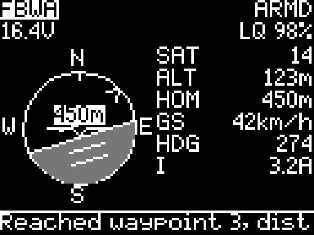
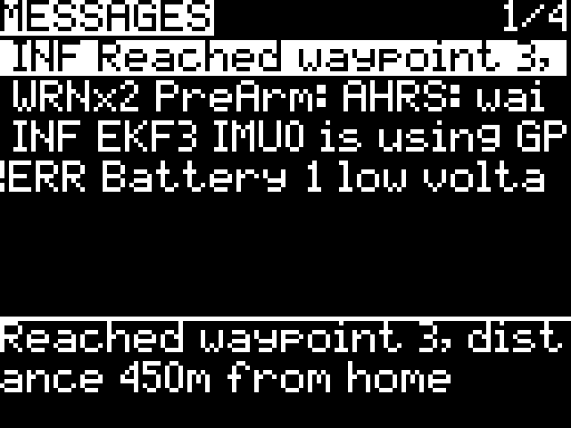

# MAV-LUA

MAVLink telemetry for your radio. A compact flight display and message viewer for ArduPilot over ExpressLRS, built for small screens and simple controls.

## Features

- **Navigation:** attitude indicator with grey ground, flight mode, arm status, battery, link quality, satellites and altitude.
- **Home guidance:** north-up compass dial showing the aircraft's direction from home, with distance over the instrument.
- **Messages:** scrollable history, severity, repeated-message counts and a full-text view. The latest message also appears on Navigation.
- **Crisp display:** native pixel text, full-width wrapping and layouts that adapt to monochrome and color radios.

| Navigation | Messages |
| --- | --- |
|  |  |

Previews use the radio's bitmap font. Confirmed on Tango 2 and on TBS Alpha running EdgeTX 2.11 with the source package.

## Installation

Download the matching package from [Releases](https://github.com/FractalEngineer/MAV-LUA/releases/latest):

| Your firmware | Package family |
| --- | --- |
| Before EdgeTX 2.11 RC1, including legacy Tango firmware | `pre-edgetx-2.11rc1` |
| EdgeTX 2.11 RC1 or newer | `post-edgetx-2.11rc1` |

Each family offers **source** and **compiled** packages. Use source on TBS Alpha / EdgeTX 2.11; use compiled on memory-constrained legacy radios.

1. Copy the package's `SCRIPTS` folder to the SD card. For a compiled package, replace both `MAV.lua` and `MAV.luac`. When switching to source, remove the old `MAV.luac` cache first.
2. Select **MAV** as a Lua telemetry screen. On a color radio, also copy `WIDGETS` and add one **MAV** widget.
3. Connect your aircraft and discover telemetry sensors in the radio's Telemetry menu.
4. Reload the model or restart the radio.

Use an ExpressLRS MAVLink link with ArduPilot. Disable any previous telemetry script that reads the same link, including INAV or Yaapu. MAV has its own filename and does not replace their files.

## Controls

| Input | Action |
| --- | --- |
| Enter / roller click | Switch Navigation and Messages |
| Roller | Select older or newer messages |
| Exit on Messages | Return to Navigation |

On color radios, open the widget full screen; tap switches pages and swipe scrolls messages.

`ARMD` means armed. `RDY` and `!RDY` reflect explicit readiness messages; `RDY?` means readiness is unknown. `ARM?` or `--` indicates unavailable data. The home marker shows the aircraft's position relative to home, independently of its heading.

The latest 20 messages are retained until the model reloads. Full text is limited to the 50 characters supplied by the link.

[Changelog](CHANGELOG.md) · [GPL-3.0 license](LICENSE)
