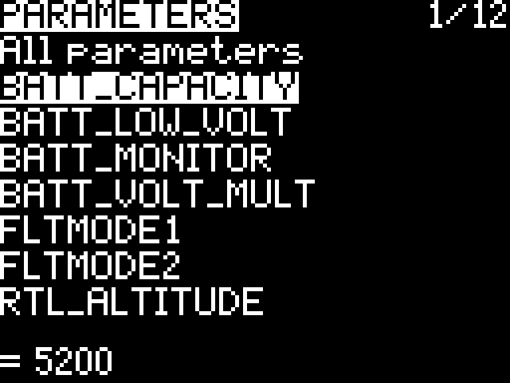
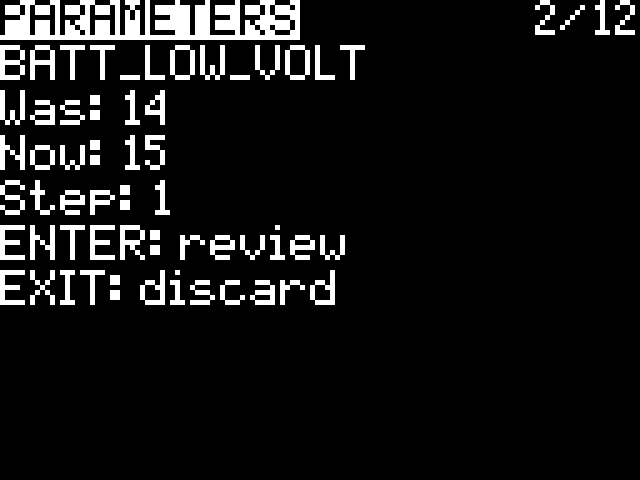
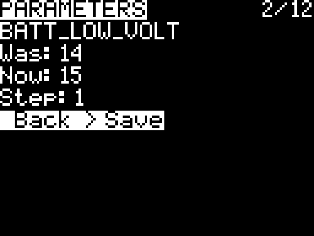

# MAV-LUA

MAVLink telemetry for your radio: a compact flight display, status-message viewer, and opt-in ArduPilot parameter browser for ExpressLRS.

## Features

- **Navigation:** attitude indicator, flight mode, battery, link quality, satellites, altitude, and Mission Planner-style ready-to-arm status.
- **Home guidance:** north-up direction-from-home marker and distance. The filled marker changes contrast across the horizon.
- **Messages:** the latest 20 MAVLink status messages, with severity, repeat counts, and full-width text wrapping.
- **Parameters:** a bounded eight-row live browser with explicit, verified writes. No parameter traffic starts until you press Load.
- **Small-radio friendly:** native bitmap text, integer drawing, bounded memory, and both telemetry-screen and Tools entry points.

| Navigation | Messages |
| --- | --- |
|  |  |

| Browse | Edit | Review |
| --- | --- | --- |
|  |  |  |

Navigation and Messages have been tested on Tango 2/FreedomTX 1.4 and TBS Alpha/EdgeTX 2.11. The v0.1.2 parameter browser and readiness path were hardware-tested on the Alpha setup described below.

## Installation

Download the matching package from [Releases](https://github.com/FractalEngineer/MAV-LUA/releases/latest):

| Firmware | Package |
| --- | --- |
| EdgeTX 2.11 RC1 or newer | `MAV-LUA-<version>_source.zip` |
| Earlier EdgeTX/FreedomTX | `MAV-LUA-<version>_precompiled.zip` |

1. Remove old MAV `.luac` caches before installing the source package: `SCRIPTS/TELEMETRY/MAV.luac`, `SCRIPTS/TOOLS/MAV.luac`, files under `SCRIPTS/MAV`, and `WIDGETS/MAV/main.luac` where present.
2. Copy the package's complete `SCRIPTS` folder to the SD card. Color-radio users should copy `WIDGETS` as well.
3. Select **MAV** as a telemetry screen, or launch **MAV** from Tools on radios whose telemetry menu reserves PAGE.
4. Discover telemetry sensors, then reload the model or restart the radio.

Use an ArduPilot vehicle over ExpressLRS MAVLink mode. Disable other telemetry scripts that consume the same CRSF queue.

## Controls

| Input | Action |
| --- | --- |
| PAGE | Cycle Navigation, Messages, and Parameters |
| Roller | Scroll messages, browse parameters, or edit a value |
| Enter | Select, confirm, or open the parameter editor |
| Menu in Parameters | Change the numeric edit step or return to Load |
| Exit | Back out or discard an edit |

On touch radios, horizontal swipes change pages, vertical swipes scroll, and taps select. Hold Exit to close the Tools application.

If Enter still changes pages after updating, the radio is loading an old cache. Remove the `.luac` files listed above, reinstall the complete package, and restart.

## Ready-to-arm status

`READY` means the autopilot reports its pre-arm check healthy, or that check is disabled. `NOT READY` means an enabled pre-arm check is failing. `ARMED` is driven by the explicit armed bit, and `READY?` means readiness or arm telemetry is missing or stale. Only `READY` and `ARMED` are inverted for at-a-glance recognition. Status-message text never changes this indicator.

## Parameters

Parameters require EdgeTX 2.11 or newer and the matching TX-side bridge in the [ExpressLRS fork](https://github.com/FractalEngineer/ExpressLRS/tree/feature/mavlink-lua-parameters). Stock ExpressLRS MAVLink telemetry does not expose autopilot parameter replies to handset Lua. The bridge is TX-only; it preserves normal telemetry conversion and the existing MAVLink OTA uplink.

- Press **Load** to discover the vehicle and fetch the first eight indexed parameters.
- Roll past either end to fetch the adjacent eight-row window. Up to four reads overlap with bounded retries.
- Select a row to refresh its value before editing. Menu changes the step size.
- Enter opens review. Choose **Save** and wait for **Saved and verified**; Exit discards the draft.

Writes require a fresh disarmed heartbeat. MAV rereads the original value, sends `PARAM_SET` once, and requires a separate matching readback before reporting success. An unconfirmed write is never repeated automatically.

The current browser deliberately retains only one small window. Moving between windows refetches values and can be slow; background prefetch and a bounded cache are planned for the next release. Parameter descriptions, enum labels, bitmask editors, and search are not yet included.

[Changelog](CHANGELOG.md) · [Protocol notes](docs/PROTOCOL.md) · [GPL-3.0 license](LICENSE)
